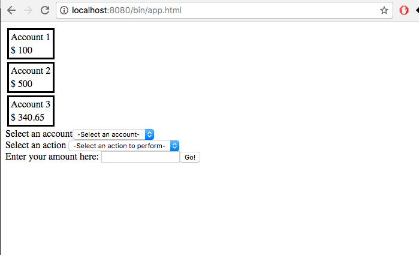

# React-Redux-Flux Bank account example

## The master branch
In the master branch I have code that follows the `Flux` approach of **unidirectional data flow**.

**The state of the application dictates the state of the components.**

I have the following components:

```
|-`Application`: This is the root container. It is also responsible for the application's state.
    |
    |-`AccountCards`: This is the container showing the account cards - displays the account names and balances
          |
          |-`AccountCard`: This is the card component that is used to display the account name and balance.
    |
    |-`AccountForm`: This is the container for the form components that are used to update the state of the app.
          |
          |-`AccountListing`: This is a dropdown list that shows the user the avaialable account names.
                |
                |-`AccountListItem`: A list item that displays the account name
          |
          |-`ActionPane`: This is a dropdown list that shows the user the list of available actions
          |
          |-`AmountDialogBox`: This is the input text box that accepts the text input from the user. It also has the `submit` button.

```

The app's state is maintained by the `Application` component. You can find the component in the [`src/ts/Bank.tsx`](./src/ts/Bank.tsx) file.

The change in state flows down the tree. In case of the `AccountForm` components, because they are HTML form elements, they maintain their own state. They propagate their state changes up the tree to the `Application`.

## Scenario when the user deposits $100 into "Account 1"

Initially, the accounts have the following balances:
* `Account 1` : `$ 100`
* `Account 2` : `$ 500`
* `Account 3` : `$ 340.65`

When the user selects `Account 1` in the `Select an account` dropdown list, the [`AccountListing`](./src/ts/AccountListing.tsx) component's `selecthandler` method is invoked - it is bound to the `onChange` event of the `<select>` used - and it extracts the selected value and passes it along to its parent component - i.e [`AccountForm`](./src/ts/AccountForm.tsx). The `AccountForm` component's `accountListingSelectHandler` method is invoked in turn.

Inside the `accountListingSelectHandler` method, the form's internal state is updated. 
Similarly, the state of the form gets updated for the selection for action using the `Select an action` dropdown list, and when the user enters the amount in the text field.

When the user clicks on the `Go!` button, the AccountForm component's `submitHandler` method is invoked, then the actual form submit happens - since I'm only on the view layer, I redirect the request back into the page and capture the form submit event in the AccountForm component's `handleFormSubmit` method. In the `handleFormSubmit` method, depending on the selections of the two dropdown lists and the value in the textfield - maintained in the `AccountForm` component's state - I create an [`Action`](./src/ts/Bank.tsx). This `action` is propagated up the virtual DOM tree to the `Application` component which then handles the action and updates the state of the application.

The `handleAction` method is the one that acts as a `reducer` that takes in the incoming action and updates the application state - it supposedly returns a new state which is then used to update the state of the component via the inherited `setState` method.

```typescript
  /**
   * AccountForm submit handler's callback
   * 
   * @param action The action propagated up the V-DOM tree
   */
  private accountFormHandler(action: Action) {
    this.setState(this.handleAction(action));
  }

  /**
   * Handles the incoming action but updating the state of the application's UI
   * This should be the reducer that will give back the updated state when using Redux?
   * 
   * @param incomingAction The incoming action from the form submit
   */
  private handleAction(incomingAction: Action): AppState {
    let matchingAccounts = filter(
      this.state.accounts,
      account => account.name === incomingAction.accountName
    );

    //only considering the first match in case of many -- this should never happen in the first case
    let matchingAccount = matchingAccounts.length > 0 ? matchingAccounts[0] : null;

    if (!matchingAccount)
      throw new Error(
        "The account named " + incomingAction.accountName + " doesn't exist"
      );

    let currentBal = matchingAccount.balance;

    switch (incomingAction.type) {
      case ActionType.Deposit:
        matchingAccount.balance = currentBal + incomingAction.amt;
        break;
      case ActionType.Withdraw:
        matchingAccount.balance = currentBal - incomingAction.amt;
        break;
    }

    //# referneces are getting passed along -- not true functional way here
    let newAppState: AppState = new AppState();
    newAppState.accounts = this.state.accounts;
    //# referneces are getting passed along -- not true functional way here

    console.log("New App State:: " + JSON.stringify(newAppState));

    return newAppState;
  }
```

## Steps to build:

* Install Node.js. This will also install its package manager Node Package Manager(npm).
* Go into the project's root (the folder that contains the package.json)
* Open terminal/command-prompt.
* Make sure the `npm` and `node` commands are available in the environment path.
* Type `npm install`. This will download and install all the dependencies.
* After its done, type `npm run start`. This should then compile the code and when its done
  you can visit the webpage at `http://localhost:8080/bin/app.html`.

You should get the following page if everything went well.

